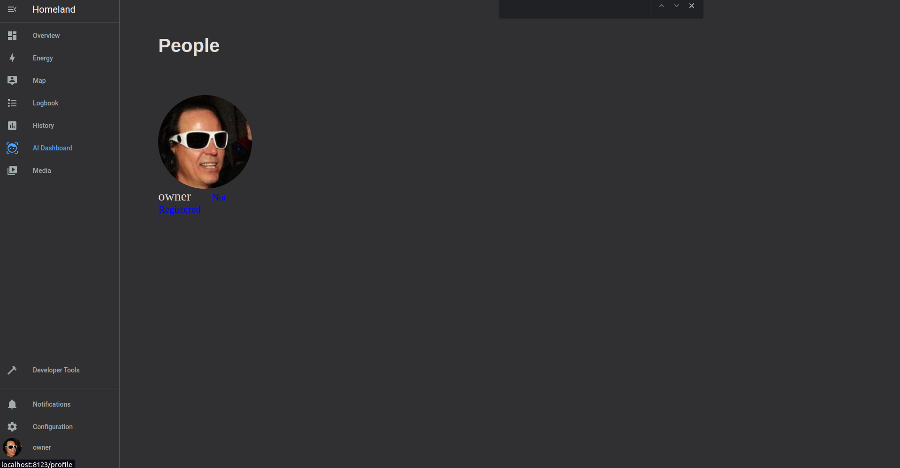

# AI Facial Recognition Dashboard


BBackend for the AI Facial Recognition Dashboard for homeland.

This dashboard creates an entity called ```image_processing.face_recognition_central```, which acts as the central processing unit of the entire integration. It is responsible for scanning, registering, and predicting faces.

# Getting started

## Setting up CompreFace

To run this custom component, you need to set up the CompreFace backend. A docker-compose file is provided in this folder (compareFace-docker-compose). Alternatively, you can also download the corresponding files from the CompreFace GitHub repository. Go to https://github.com/exadel-inc/CompreFace/releases/ and follow the instructions.

To run the docker-compose simply type 
```
cd compreFace-docker-compose
docker-compose up -d
```

If this is your first time using the compreFace API, make sure you clean the registered faces. Some compreFace releases come with a demo database which you might need to delete. Simple run the clean.sh while the docker-container is running 

```
sh clean.sh
```

## Setting up integration

1. Copy the contents for custom_compoent/ai_dashboard to the custom_components in your homeassistant configuration folder
2. Restart Homeassistant 
3. Go to the integration tab in the HA fronten and setup using configFlow 

Parameters/Options explanation

- Dev mode: indicates whether the frotend is running in development mode. Leave if unchecked unless you want to develop
- API IP addres: the IP address of the device where the compreFace API is hosted. 
- API Port: the port number of the device where the compreFace API is hosted. 
- CompreFace recognition key: the CompreFace API key for face recognition.
- CompreFace detection API key: the CompreFace API key for face detection.
- Timeout: the timeout for API requests.
- Minimum confidance: the minimum confidence level for face recognition. Between 1 and 100
- Detect Face Only: Indicates whether to detect faces only. Default is False.
- Save file Folder: The folder path to save the image.
- Save faces folder: The folder path to save the recognized faces. 


This will create a new dashboard where you can register faces. The face detection/recognition is performed through a service

To get the CompreFace API keys, go to http://localhost:8000/ (or whatever the IP address of the machine you are running CompreFace). By default the keys should be "00000000-0000-0000-0000-000000000002" for recognition and "00000000-0000-0000-0000-000000000003" for dections. 
If these keys to not exist you can always create new keys. 


## How does it work? 

### Registering faces

If you are using detection only you can skip this step. 
To register a face you need to go the "AI Dashboard" tab that was just created. 



You will see a list of users as well as the registered status. If everything was corretly setup you should have all user with the "not registered" status. 

From here, you can upload your photo to register the respective faces. You can upload more than one photo at the same time, but make sure that the face is visible and is the only face in the photo before uploading. After uploading, you will receive a notification on Home Assistant with the number of photos uploaded.

### Detecting/Recognizing faces

After the last step you can 
Example of scan service: 

```

service: ai_dashboard.scan
target:
  entity_id: image_processing.face_recognition_central
data:
  camera_scan_entity_id: camera.generic_camera
```

After the scan the image_processing entity update its attributes. This has the information on the number of faces, if any face was recognized and other metrics


## FAQs

### How does Face Recognition works?
The AI dashboard allows you to register a name/id with a face by sending at least 1 image containing the person’s face and corresponding name/id. Once a face has been registered, the API can recognize the person in new image (e.g in cameras) by calling the corresponding service.

There is no limit to the the number of faces you send for improved recognition accuracy. Although by our benchmarks, one photos is usually enough, It is recommended that you provide diverse images of the person’s face in several angles. 


### What if I try to recognize a face I haven’t registered?
The Face API will still return a detected a face but it will be recognized as unknown.

### Can I update a registered face with more images?
Yes. All you need to do is to go to the AI dashboard and upload another photo. 

# Dev test:
I recommend using a virtual enviroment for the following

Install the test requirements ```requirements_test.txt```

In the newest version of pytest-homeassistant-custom-component (0.12.29) the test need to be marked by @pytest.mark.asyncio or the pytest command need the flag --asyncio-mode=auto

e.g. 
``` pytest tests/ --asyncio-mode=auto ```

You might need to run the pytest using the -m flag if the above command dones not work

``` python3 -m pytest tests```